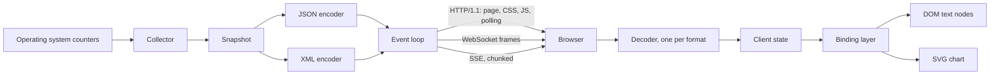

# Pulse

A live metrics dashboard. Course project for Internet Programming, MEng in Computer and
Software Engineering, Faculty of Computer Systems and Technologies, TU-Sofia.

## What it is

Pulse streams live measurements from a running process to a browser and draws them as
they arrive. The server is a single C++20 program that speaks HTTP/1.1 for the initial
page load and WebSocket for everything after that, both parsed and generated in project
code. The browser side is a plain page with no application framework: it talks to the DOM
directly, draws its chart as SVG, and lays itself out with CSS Grid. The same value packet
can be sent as either XML or JSON, and delivered over any of three transports, so the
alternatives can be measured against each other instead of argued about.

## Goals

- Serve HTTP/1.1 and complete a WebSocket upgrade handshake from own code, no application
  server.
- Push a metric to the browser and render it without a page reload or a poll.
- Serialise one value packet into both XML and JSON behind a single internal contract,
  switchable at run time without reconnecting.
- Render charts as SVG nodes that accept events, not as a raster image.
- Implement data binding by hand, against the DOM, with no framework.
- Measure end-to-end latency, message size and parse time, and report the numbers.

## Dependencies

None. A C++20 compiler and CMake 3.20 are enough. There is no package manager step, no
network fetch at configure time, and no optional feature that is on by default.

The test runner is 119 lines in `tests/check.hpp`, the timing harness uses
`std::chrono::steady_clock`, and SHA-1 and Base64 are implemented in `src/websocket.cpp`
because RFC 6455 needs them for the handshake. The only libraries linked are the ones the
operating system already ships: `ws2_32` and `psapi` on Windows, pthreads elsewhere.

## Technologies

| Technology | Version or standard | Why |
| --- | --- | --- |
| C++ | C++20 (ISO/IEC 14882:2020) | Direct memory control and predictable timing, which matters when latency is the thing being measured. |
| CMake | 3.20 or newer | Builds the same way across compilers without a per-toolchain script. |
| HTTP | RFC 9110, RFC 9112 | Initial page load, the polling transport and the upgrade request. Parsed in project code, since protocol handling is part of the coursework. |
| WebSocket | RFC 6455 | Bidirectional channel: server pushes values, client sends format and subscription commands. |
| Server-sent events | HTML Living Standard | One-way transport, framed with the chunked transfer coding, kept so it can be compared against WebSocket on the same data. |
| JavaScript | ECMA-262, no framework | Keeps the DOM, event and binding work visible in the source instead of hidden behind a library. |
| SVG | SVG 2 | Every chart point is a document node, so it takes event handlers and CSS transitions. |
| CSS Grid | CSS Grid Layout Module Level 1 | Native two-dimensional layout, no layout library. |
| XML and JSON | XML 1.0 (Fifth Edition), RFC 8259 | Two wire formats behind one contract, so the difference can be measured. |

## Architecture

One listening socket, one event loop, three transports. The loop is single threaded: every
piece of shared state is touched from exactly one thread, so the project carries no locks.



| Path | Contents |
| --- | --- |
| `include/pulse/`, `src/` | The server. One header and one translation unit per concern: `net`, `http`, `websocket`, `metrics`, `codec`, `server`. |
| `web/` | The client: `index.html`, `app.css`, `app.js`. Served from disk, no build step. |
| `tests/` | `check.hpp`, the test runner, and `tests.cpp`, the suite. |
| `docs/` | The project report in LaTeX. |

## Build

Verified on Windows 11 with g++ 15.2.0 (MinGW-w64), CMake 4.3.2 and Ninja 1.13.2.

```bash
cmake -S . -B build -G Ninja -DCMAKE_BUILD_TYPE=Release
cmake --build build
```

Leave out `-G Ninja` to use the platform default generator. The build produces
`pulse-server`, `pulse-demo` and `pulse-tests`.

## Run

The demo starts the server, measures itself over all three transports, prints the results,
and then keeps serving so the page can be opened:

```bash
cmake --build build --target demo
```

Or run the server alone:

```bash
./build/pulse-server --port 8080 --interval 250
# then open http://localhost:8080
```

Options are `--port`, `--web` (the directory with the client files) and `--interval` (the
milliseconds between snapshots, 50 to 5000).

## Tests

```bash
ctest --test-dir build --output-on-failure
```

35 cases, 586 checks. They cover the HTTP parser against split and pipelined input, the
WebSocket frame codec against the vectors published in RFC 6455 and against malformed
frames, the histogram, both encoders and both decoders, and the running server over a real
socket for all three transports.

## Measurements

```bash
./build/pulse-demo --bench
```

Runs the same measurements with more repetitions and exits without serving. It reports
payload size, encode time and parse time for JSON against XML, then latency and bandwidth
for WebSocket against server-sent events against polling, then delivery and latency at 1,
8, 32 and 128 concurrent WebSocket clients. Every number in the report chapter came out of
this command.

## Documentation

The project report lives in `docs/`. It is written in Bulgarian and follows the TU-Sofia
ФКСТ format for coursework (A4, Times metrics at 12 pt, 1.5 line spacing, Roman numeral
section headings, page numbers bottom right).

```bash
cd docs
latexmk -pdf Main.tex   # output: docs/build/Main.pdf
```

Unfilled facts are marked with `\TODO{...}` and can be listed with:

```bash
grep -rn 'TODO' docs/chapters docs/Main.tex docs/references.bib
```

## Status

- [x] Repository scaffold
- [x] Report skeleton in `docs/` with the faculty format applied
- [x] HTTP/1.1 request parsing, keep-alive, pipelining, chunked responses
- [x] WebSocket handshake, frame codec, fragmentation, ping, pong, close
- [x] Metrics collector reading process CPU, resident memory, request counts and a
      latency histogram
- [x] JSON encoder and decoder
- [x] XML encoder and decoder
- [x] Server-sent events as a third transport
- [x] Browser client: connection, state, binding layer
- [x] SVG chart rendering with event delegation
- [x] CSS Grid layout, transitions, light and dark theme
- [x] Test suite
- [x] Measurement harness
- [x] Measurements taken and written up

## License

MIT. See [LICENSE](LICENSE).
