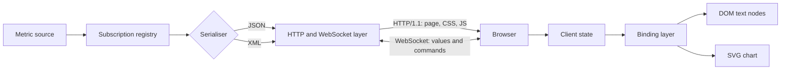

# Pulse

A live metrics dashboard. Course project for Internet Programming, MEng in Computer and
Software Engineering, Faculty of Computer Systems and Technologies, TU-Sofia.

## What it is

Pulse streams live measurements from a machine to a browser and draws them as they
arrive. The server is a single C++20 program that speaks HTTP/1.1 for the initial page
load and WebSocket for everything after that. The browser side is a plain page with no
application framework: it talks to the DOM directly, draws its charts as SVG, and lays
itself out with CSS Grid. The same value stream can be sent as either XML or JSON, so the
two representations can be measured against each other instead of argued about.

## Goals

- Serve HTTP/1.1 and complete a WebSocket upgrade handshake from own code, no application
  server.
- Push a metric to the browser and render it without a page reload or a poll.
- Serialise one value packet into both XML and JSON behind a single internal contract,
  switchable at runtime.
- Render charts as SVG nodes that accept events, not as a raster image.
- Implement data binding by hand, against the DOM, with no framework.
- Measure end-to-end latency, message size and parse time, and report the numbers.

## Technologies

| Technology | Version or standard | Why |
| --- | --- | --- |
| C++ | C++20 (ISO/IEC 14882:2020) | Direct memory control and predictable timing, which matters when latency is the thing being measured. |
| CMake | 3.20 or newer | Builds the same way across compilers without a per-toolchain script. |
| HTTP | RFC 9110, RFC 9112 | Initial page load and the upgrade request. Parsed in project code, since protocol handling is part of the coursework. |
| WebSocket | RFC 6455 | Bidirectional channel: server pushes values, client sends subscription and format commands. |
| Server-sent events | HTML Living Standard | Kept as a one-way fallback channel so it can be compared against WebSocket on the same data. |
| JavaScript | ECMA-262, no framework | Keeps the DOM, event and binding work visible in the source instead of hidden behind a library. |
| SVG | SVG 2 | Every chart point is a document node, so it takes event handlers and CSS transitions. |
| CSS Grid | CSS Grid Layout Module Level 1 | Native two-dimensional layout, no layout library. |
| XML and JSON | XML 1.0 (Fifth Edition), RFC 8259 | Two wire formats behind one contract, so the difference can be measured. |

## Architecture

The server holds a metric source, a subscription registry, two serialisers and a network
layer. The network layer accepts a normal HTTP request, and if that request asks for a
WebSocket upgrade it hands the connection to the frame parser. Values flow from the source
through the registry to whichever serialiser the client selected. The browser receives
message frames, applies them to a state object, and a binding layer pushes only the changed
paths into the DOM and the SVG chart.



## Build

There is no `CMakeLists.txt` in the tree yet, so none of this runs today. It is the
intended build once the source exists.

```bash
cmake -S . -B build -DCMAKE_BUILD_TYPE=Release
cmake --build build
./build/pulse-server --port 8080 --web ./web
# then open http://localhost:8080
```

Tests:

```bash
ctest --test-dir build --output-on-failure
```

## Documentation

The project report lives in `docs/`. It is written in Bulgarian and follows the TU-Sofia
ФКСТ format for coursework (A4, Times metrics at 12 pt, 1.5 line spacing, Roman numeral
section headings, page numbers bottom right).

```bash
cd docs
latexmk -pdf Main.tex   # output: docs/build/Main.pdf
```

Unfilled facts are marked with `\TODO{...}` and can be listed with:

```bash
grep -rn 'TODO' docs/chapters docs/Main.tex docs/references.bib
```

## Status

- [x] Repository scaffold
- [x] Report skeleton in `docs/` with the faculty format applied
- [ ] HTTP/1.1 request parsing
- [ ] WebSocket handshake and frame parser
- [ ] Metric source and subscription registry
- [ ] JSON serialiser
- [ ] XML serialiser
- [ ] Server-sent events fallback channel
- [ ] Browser client: connection, state, binding layer
- [ ] SVG chart rendering
- [ ] CSS Grid layout and transitions
- [ ] Test suite
- [ ] Measurement harness
- [ ] Measurements taken and written up

Nothing under `src/`, `include/`, `tests/` or `web/` is implemented yet. The results
chapter of the report contains no numbers on purpose: it is a skeleton until the
measurements exist.

## License

MIT. See [LICENSE](LICENSE).
